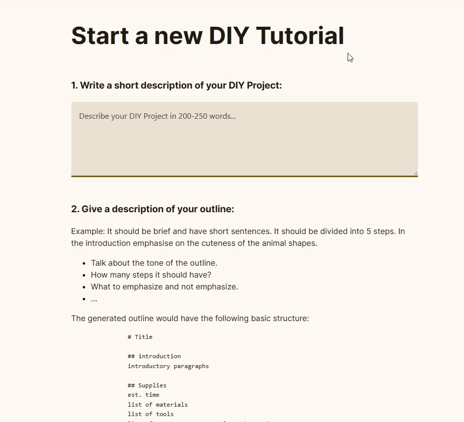
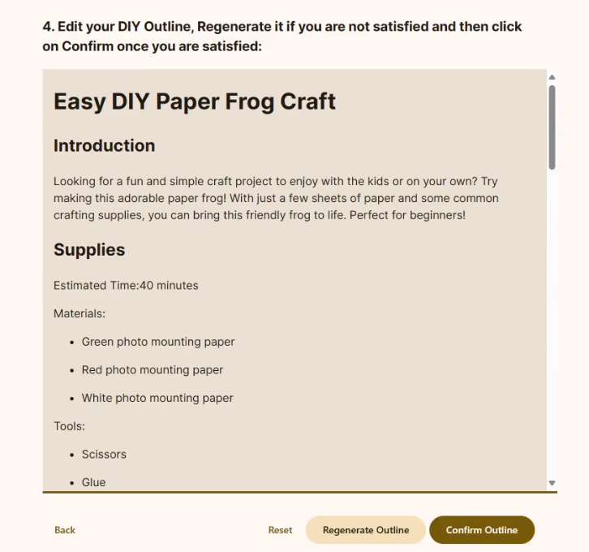
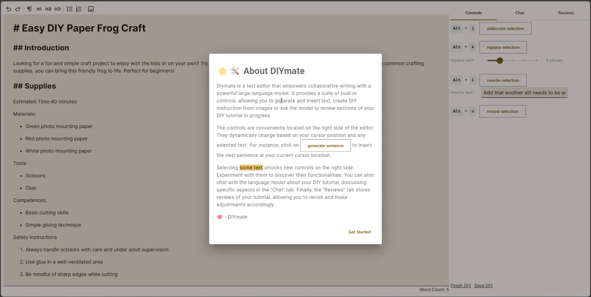
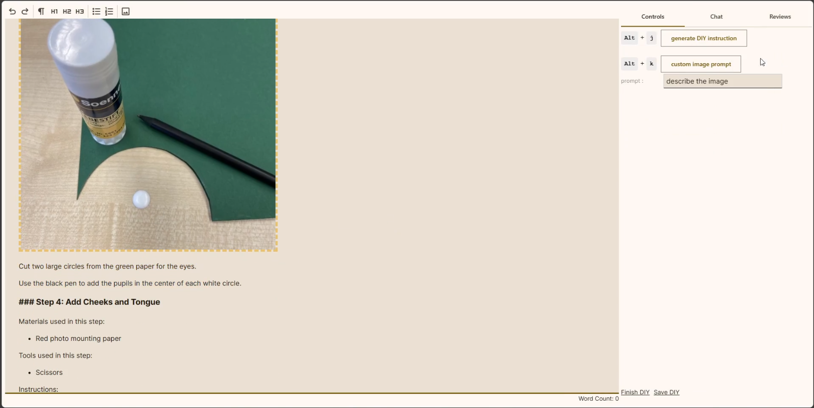

# DIYMate

Author: Shailesh Iyer

This is a master's thesis project that used to create a functional prototype to test how Large language models can be used to support the authorship of DIY (Do-It Yourself) Tutorials for Makers and DIYers.

The initial project was heavily inspired from [Wordcraft](https://github.com/PAIR-code/wordcraft) and extensive modifications were made to move from mobile-doc kit to Tiptap, and major version upgrades for lit-html and Mobx to accomodate the research goals and needs of this project.







## Structure

The basic structure of the repository is the lit-html project in src/ and the python flask project as the backend/. 

## Build

Create a .env file with an OPENAI_API_KEY.
Install the required packages 

```bash
pip install -r requirements.txt
npm i
```

Start the backend and frontend using the following commands:

```bash
# backend
python backend/api_server.py --config_dir './config' --log_dir './logs' --port 5555 --proj_name 'diy_mate' --debug
# frontend
npm run dev
```
